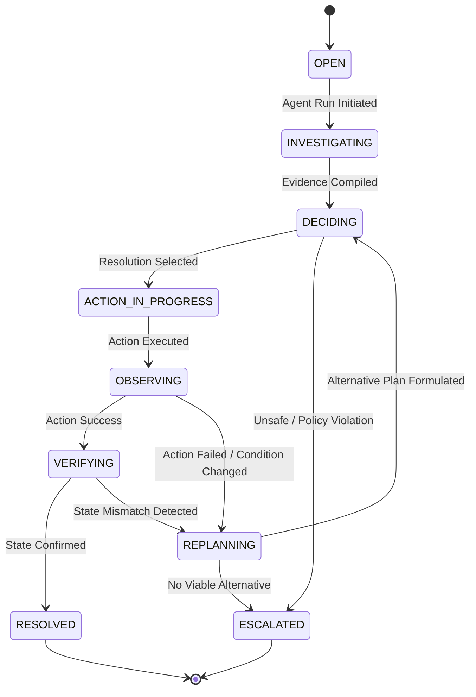

# ResolveFlow System Architecture

## 1. Overview & Vision
**ResolveFlow** is an autonomous customer resolution system designed to resolve customer complaints through deterministic enterprise tools, persistent state management, and closed-loop agentic replanning. Unlike passive customer service chatbots, ResolveFlow executes actions, observes environmental feedback, verifies outcomes, and automatically recovers when initial resolutions fail.

---

## 2. High-Level System Architecture

```
┌──────────────────────────────────────────────────────────────────────────┐
│                             FRONTEND (React + Vite)                      │
│  - Case Management Dashboard    - Live Agent Journey Graph               │
│  - Case Creation & Goal Input   - Evidence & Decision Inspector          │
│  - System State Viewer          - Controlled Failure Simulator           │
└────────────────────────────────────┬─────────────────────────────────────┘
                                     │ REST / JSON (Common Contract)
                                     ▼
┌──────────────────────────────────────────────────────────────────────────┐
│                         BACKEND (Express.js / Node.js)                   │
│                                                                          │
│  ┌───────────────────────┐          ┌──────────────────────────────────┐ │
│  │    Agent Orchestrator │ ◄──────► │       Deterministic Tools        │ │
│  │  - Goal Understanding │          │  - Customer Info Retriever       │ │
│  │  - Tool Selection     │          │  - Order / Item Inspector        │ │
│  │  - Observation Loop   │          │  - Inventory Availability Check  │ │
│  │  - Failure Detection  │          │  - Policy Rules Engine           │ │
│  │  - Re-planning Engine │          │  - Action Executors (Refund/...) │ │
│  │  - State Machine      │          │  - Verification Verifier         │ │
│  └───────────┬───────────┘          └──────────────────────────────────┘ │
│              │                                                           │
│              ▼                                                           │
│  ┌─────────────────────────────────────────────────────────────────────┐ │
│  │                     Data Access Layer (Mongoose)                    │ │
│  └───────────────────────────────────┬─────────────────────────────────┘ │
└──────────────────────────────────────┼───────────────────────────────────┘
                                       │
                                       ▼
┌──────────────────────────────────────────────────────────────────────────┐
│                         DATABASE (MongoDB Atlas / Local)                 │
│  - Cases       - AgentRuns     - AgentEvents     - Customers  - Orders   │
│  - Products    - Inventory     - Policies        - Actions    - Verifs   │
└──────────────────────────────────────────────────────────────────────────┘
```

---

## 3. Module Ownership & Boundaries

| Module | Primary Owner | Scope & Responsibility | Primary Directories |
| :--- | :--- | :--- | :--- |
| **Module 1** | **Member 1** | **Customer Experience & Case Management**: React UI, Dashboard, Case Creation, Agent Journey Flow, Evidence Viewer, Design System | `client/` |
| **Module 2** | **Member 2** | **Autonomous Agent & Replanning Engine**: Agent Orchestration, Goal Understanding, Tool Registry, Observation & Re-planning Loop, Escalation | `server/src/services/agent/`, `server/src/tools/` |
| **Module 3** | **Member 3** | **Enterprise Intelligence & Evidence**: Customer, Order, Product, Inventory, Policy engines, Seed synthetic data, Enterprise retrieval | `server/src/models/`, `server/src/services/customer/`, `server/src/services/order/`, `server/src/services/inventory/`, `server/src/services/policy/` |
| **Module 4** | **Member 4** | **Action Execution, Simulation & Verification**: State-changing actions (Refund, Replacement, Cancel), Controlled Failure Simulator, Verification, Audit Trail | `server/src/services/actions/`, `server/src/services/verification/` |

---

## 4. Agentic Loop & State Machine

ResolveFlow operates as a deterministic, feedback-driven state machine rather than a simple prompt chain:



### Event Lifecycle & Structured Event Log
Every step in the agent cycle publishes a structured event into the `AgentEvent` collection:
1. `GOAL_RECEIVED` — Customer request parsed into an actionable goal.
2. `INVESTIGATION` — Inquiry into customer, order, warranty, and policy entities.
3. `TOOL_SELECTION` — Selected tool based on current state and goal.
4. `TOOL_EXECUTION` — Execution of deterministic tool with parameters.
5. `DECISION` — Selection of resolution pathway (e.g. replacement vs refund).
6. `ACTION_STARTED` — Execution of state-changing mutation.
7. `ACTION_RESULT` — Direct outcome of mutation.
8. `OBSERVATION` — Environmental evaluation of state change.
9. `FAILURE` — Explicit detection of a barrier (e.g. out of stock, payment gateway down).
10. `REPLAN` — Re-evaluation of strategy and alternative selection.
11. `VERIFICATION` — Independent query validating resulting database state.
12. `ESCALATION` — Safe transfer to human team if autonomous resolution is blocked.
13. `RESOLUTION` — Case closed with verified state.

---

## 5. Shared Design Principles

1. **Deterministic Backend Tools as Source of Truth**: The LLM chooses *what* to do based on schemas, but business logic, calculations, inventory verification, and state changes are executed by deterministic JavaScript functions.
2. **No Hidden Chain-of-Thought**: The UI and API only expose sanitized reasoning summaries, tool inputs/outputs, and decision rationales.
3. **Idempotency & Audit Trails**: Every state-changing action includes an `idempotencyKey` and creates an immutable `AuditEvent`.
4. **Resilient Error Boundaries**: Backend service failures return standard error structures with domain error codes rather than unhandled promise rejections or leaked stack traces.
